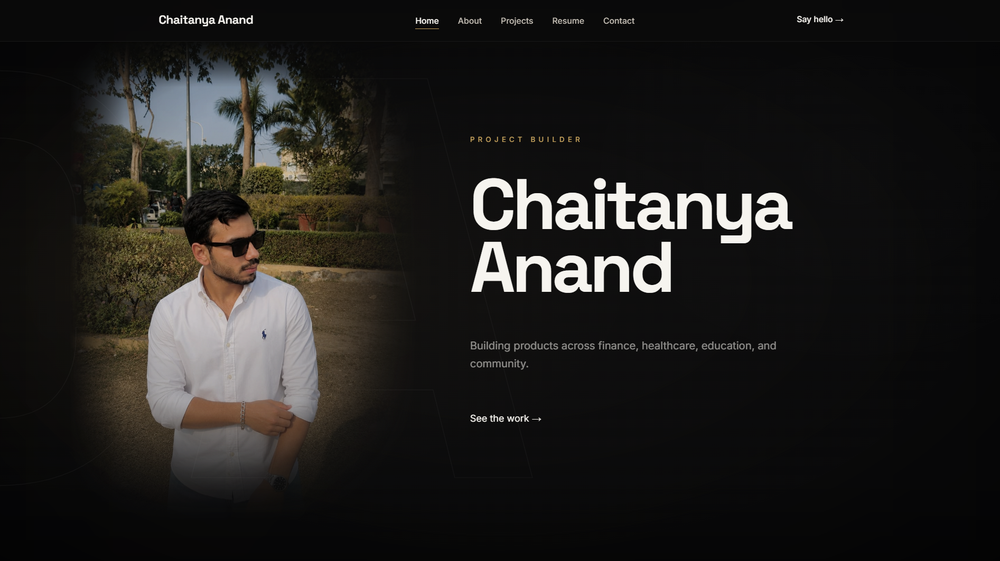
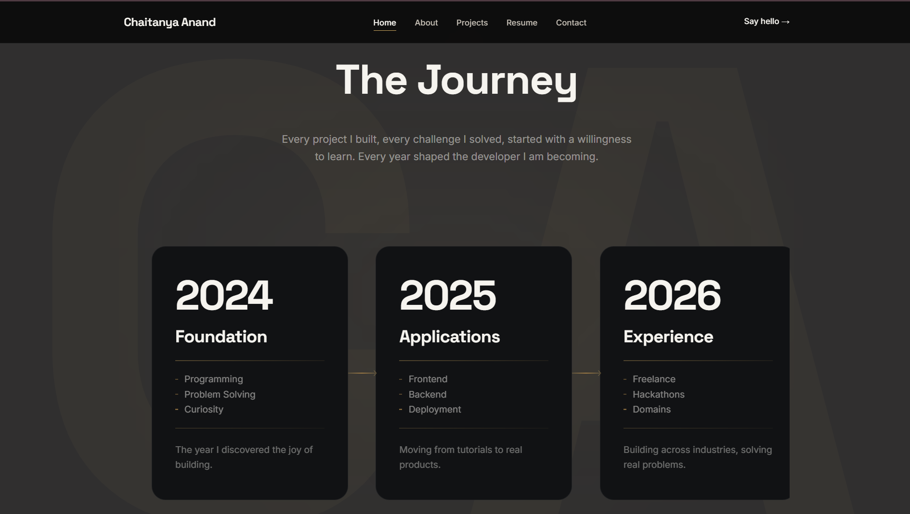
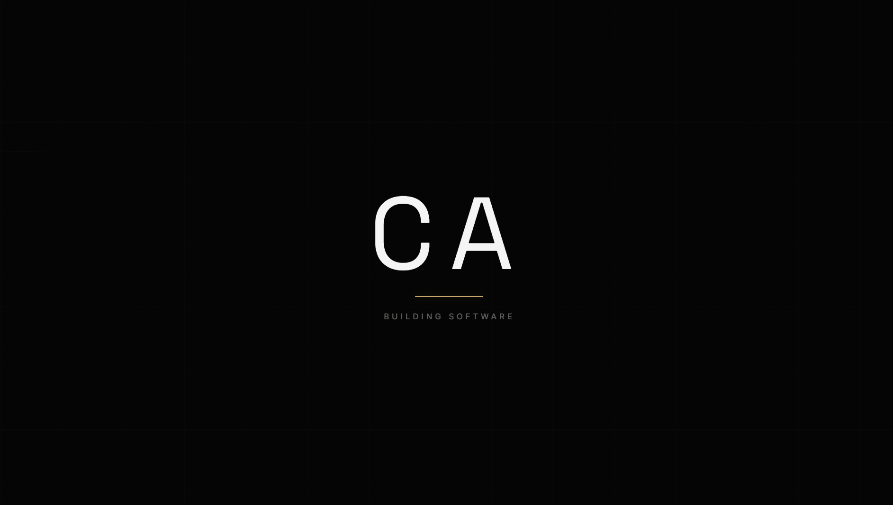

<div align="center">

<!-- ============================================ -->
<!-- HERO                                         -->
<!-- ============================================ -->



# Chaitanya Anand

### Software Engineer &bull; Full Stack Developer &bull; AI Enthusiast

Building software that solves real problems — across finance, healthcare, education, and community.

<br>


<br>

<a href="[https://your-portfolio-url](https://fluffy-crisp-1722bc.netlify.app/)">

</a>

</div>

---

<br>

## About

This portfolio represents my engineering journey — the projects I've built, the problems I've solved, and the design philosophy behind every line of code. It's not a template. It's not a theme. It's a handcrafted reflection of how I think about software, systems, and building things that matter.

Every page was built from scratch with HTML and CSS. No frameworks. No builders. Just code, intention, and attention to detail.

<br>

---

<br>

## Features

| Feature | Description |
|:--------|:------------|
| **Premium Editorial Design** | Dark theme with gold accents, blueprint overlays, and engineering notebook aesthetic |
| **Fully Responsive** | Seamless experience across desktop, tablet, and mobile |
| **HTML + CSS Only** | Zero JavaScript — pure markup and styling craftsmanship |
| **Dedicated Project Pages** | Individual case studies with full project breakdowns |
| **Engineering Timeline** | Visual career journey from foundation to growth |
| **Career Archive** | Dual professional profiles — Software Engineer + Freelancer |
| **Mission Control Contact** | System-status inspired contact page with live availability |
| **Case Study Pages** | Deep-dive project documentation with tech stacks and outcomes |
| **Modern Typography** | Space Grotesk + Inter font pairing for editorial clarity |
| **Dark Theme** | Premium dark UI designed for focus and visual hierarchy |

<br>

---

<br>

## Screenshots

<table>
  <tr>
    <td align="center" width="50%">
      <strong>Home</strong><br><br>
      
      <br><em>Hero section with portrait, name, and call to action</em>
    </td>
    <td align="center" width="50%">
      <strong>Journey</strong><br><br>
      
      <br><em>Career timeline from foundation to growth</em>
    </td>
  </tr>
  <tr>
    <td align="center" width="50%">
      <strong>Engineering Mindset</strong><br><br>
      
      <br><em>How I think while building software</em>
    </td>
    <td align="center" width="50%">
      <strong>Loader</strong><br><br>
      
      <br><em>Pure CSS animated loader with CA monogram</em>
    </td>
  </tr>
</table>

<br>

---

<br>

## Folder Structure

```
portfolio/
├── index.html
├── README.md
├── .gitignore
│
├── pages/
│   ├── about.html
│   ├── projects.html
│   ├── resume.html
│   ├── contact.html
│   ├── project-cloudboard.html
│   ├── project-deepinsight.html
│   └── project-merchantos.html
│
├── css/
│   ├── style.css
│   └── responsive.css
│
├── images/
│   ├── chaitanya.jpg
│   ├── chaitanya2.jpeg
│   ├── tradex.png
│   ├── orenburg.png
│   ├── townhall.png
│   └── procrastination.png
│
├── documents/
│   ├── Chaitanya Anand Software Resume.pdf
│   └── Chaitanya Anand Resume.pdf
│
├── screenshots/
│   ├── Home.png
│   ├── Journey.png
│   ├── Engineer mindeset.png
│   └── Loader.png
│
└── .vscode/
    └── launch.json
```

<br>

---

<br>

## Pages

| Page | Path | Description |
|:-----|:-----|:------------|
| **Home** | `index.html` | Hero with portrait, journey timeline, engineering toolkit, mindset blocks, and future roadmap |
| **About** | `pages/about.html` | Engineering notebook entry, debugging philosophy, freelancing lessons |
| **Projects** | `pages/projects.html` | Tiered project archive with feature, standard, and compact cards |
| **Resume** | `pages/resume.html` | Career archive with dual profile cards — Software Engineer + Full Stack Freelancer |
| **Contact** | `pages/contact.html` | Mission control interface with contact cards, availability status, and CTA |
| **Project Case Studies** | `pages/project-*.html` | Individual deep-dive pages for each featured project |

<br>

---

<br>

## Featured Projects

<table>
  <tr>
    <td width="50%" valign="top">
      <h3>📈 TradeX</h3>
      <p><strong>Category:</strong> Fintech</p>
      <p>Real-time trading platform with live market data, interactive candlestick charts, portfolio tracking, and intelligent trade execution engine.</p>
      <p>
        <code>React</code> <code>Node.js</code> <code>WebSocket</code> <code>MongoDB</code> <code>Express</code> <code>Chart.js</code>
      </p>
    </td>
    <td width="50%" valign="top">
      <h3>🏥 Orenburg Healthcare</h3>
      <p><strong>Category:</strong> Healthcare</p>
      <p>Healthcare product packaging and brand identity system for a medical supplies company, emphasizing clarity, trust, and clinical precision.</p>
      <p>
        <code>Figma</code> <code>Illustrator</code> <code>Brand System</code>
      </p>
    </td>
  </tr>
  <tr>
    <td width="50%" valign="top">
      <h3>🏛️ Townhall</h3>
      <p><strong>Category:</strong> Civic Tech</p>
      <p>Community-driven discussion platform enabling local governance conversations, town hall meetings, and civic engagement at scale.</p>
      <p>
        <code>React</code> <code>Flask</code> <code>PostgreSQL</code>
      </p>
    </td>
    <td width="50%" valign="top">
      <h3>📊 Student Procrastination System</h3>
      <p><strong>Category:</strong> EdTech</p>
      <p>Analytics-driven system that tracks study patterns, identifies procrastination triggers, and provides actionable insights for better time management.</p>
      <p>
        <code>Python</code> <code>TensorFlow</code>
      </p>
    </td>
  </tr>
  <tr>
    <td width="50%" valign="top">
      <h3>♿ Inclusify</h3>
      <p><strong>Category:</strong> Hackathon — HackMol 6.0</p>
      <p>Inclusive design platform promoting accessibility awareness and community-driven inclusive design patterns.</p>
      <p>
        <code>React</code> <code>Node.js</code>
      </p>
    </td>
    <td width="50%" valign="top">
      <h3>🤝 Cuddle Buddy</h3>
      <p><strong>Category:</strong> Social</p>
      <p>Friendly social interface designed to foster meaningful connections and community engagement through intuitive interaction patterns.</p>
      <p>
        <code>React</code> <code>Tailwind CSS</code>
      </p>
    </td>
  </tr>
</table>

<br>

---

<br>

## Design Philosophy

This website was inspired by the idea of an **engineering notebook** — a place where every page documents a thought process, not just a visual output.

Every section is built like a notebook entry: layered backgrounds, blueprint annotations, coordinate markers, and scattered technical notes. The design language borrows from engineering documentation, architectural drafts, and technical schematics.

**No UI frameworks were used.** No Tailwind. No Bootstrap. No component libraries. Every element — from the loader animation to the contact status panel — was handcrafted with vanilla HTML and CSS.

The goal wasn't to build a website. It was to build a **craft artifact** — something that reflects how I think about engineering: with structure, intention, and obsessive attention to detail.

<br>

---

<br>

## Tech Stack

<div align="center">


</div>

<br>

---

<br>

## Installation

```bash
# Clone the repository
git clone https://github.com/Anandsahab/portfolio.git

# Navigate to the project
cd portfolio
```

Open `index.html` in your browser, or use **VS Code Live Server** for the best development experience.

> **No dependencies. No build tools. No node_modules.** Just open and run.

<br>

---

<br>

## Connect

<div align="center">

<a href="https://github.com/Anandsahab">

</a>

<a href="https://www.linkedin.com/in/chaitanya-anand-3097b43b9">

</a>

<a href="mailto:chaitanyaanand680@gmail.com">

</a>

<a href="https://your-portfolio-url">

</a>

</div>

<br>

---

<br>

<div align="center">

### Designed & Developed by Chaitanya Anand

&copy; 2026

</div>
